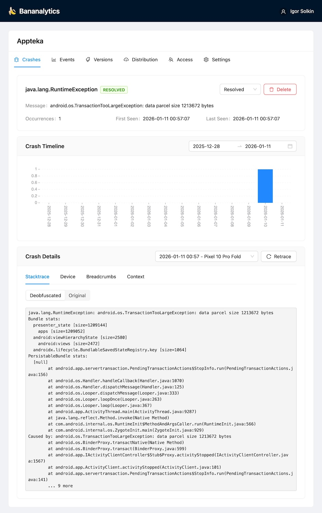
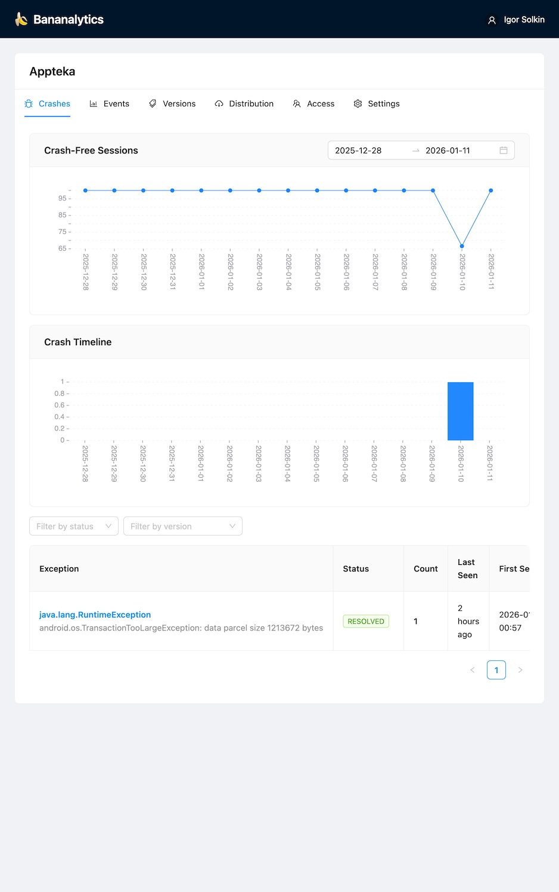

# 🍌 Bananalytics

Lightweight self-hosted crash reporting and analytics platform for Android applications. A simple alternative to Firebase Crashlytics or HockeyApp.

<table>
  <tr>
    <td></td>
    <td></td>
  </tr>
</table>

## Features

- **Crash Reporting** — Automatic crash grouping by stacktrace fingerprint
- **R8/ProGuard Deobfuscation** — Upload mapping files to decode stacktraces
- **Event Analytics** — Track custom events with tags and numeric fields
- **APK Distribution** — Upload APK builds for testers with release notes
- **Breadcrumbs** — See user actions leading up to a crash
- **Session Tracking** — Crash-free sessions and unique session metrics
- **Multi-user Access** — Share apps with team members (admin/viewer/tester roles)
- **Email Invitations** — Invite users by email, even if they're not registered yet
- **Version Muting** — Disable crash/event collection for specific versions
- **Self-hosted** — Full control over your data

## Quick Start

### Development

```bash
docker compose up
```

Services:
- **Frontend**: http://localhost:3177
- **Backend API**: http://localhost:8266
- **pgAdmin**: http://localhost:5050 (admin@admin.com / admin)
- **MinIO Console**: http://localhost:9101 (bananalytics / bananalytics_dev)

### Production

```bash
# Create external network (if not exists)
docker network create reverseproxy

# Configure environment
cp env.example .env
# Edit .env with secure values

# Start services
docker compose -f docker-compose.prod.yml up -d
```

The production setup uses Nginx as a reverse proxy. Only the `bananalytics-nginx` container is exposed to the `reverseproxy` network. Connect your main HTTPS server to proxy requests to it.

## Configuration

| Variable | Description | Default |
|----------|-------------|---------|
| `POSTGRES_PASSWORD` | Database password | Required |
| `S3_ACCESS_KEY` | MinIO/S3 access key | Required |
| `S3_SECRET_KEY` | MinIO/S3 secret key | Required |
| `S3_BUCKET` | Bucket for mapping files | `bananalytics` |
| `REGISTRATION_ENABLED` | Allow new user registration | `false` (prod) |
| `SMTP_HOST` | SMTP server host | — |
| `SMTP_PORT` | SMTP server port | `587` |
| `SMTP_USER` | SMTP username | — |
| `SMTP_PASSWORD` | SMTP password | — |
| `SMTP_FROM` | Sender email address | `noreply@bananalytics.local` |
| `SMTP_FROM_NAME` | Sender display name | `Bananalytics` |
| `BASE_URL` | Public URL for invitation links | `http://localhost:5173` |

**Note:** SMTP is optional. If not configured, invitations are created but no emails are sent — you'll need to share registration links manually.

## Android SDK

Official Android SDK: **[bananalytics-android](https://github.com/solkin/bananalytics-android)**

### Installation (JitPack)

```gradle
// settings.gradle
dependencyResolutionManagement {
    repositories {
        maven { url 'https://jitpack.io' }
    }
}

// build.gradle
dependencies {
    implementation 'com.github.solkin:bananalytics-android:<version>'
}
```

> Check the [SDK repository](https://github.com/solkin/bananalytics-android/releases) for the latest version.

### Quick Start

```kotlin
val bananalytics = BananalyticsImpl(
    filesDir = context.filesDir,
    config = BananalyticsConfig(
        baseUrl = "https://your-server.com",
        apiKey = "bnn_xxxxx"
    ),
    environmentProvider = MyEnvironmentProvider(),
    isDebug = BuildConfig.DEBUG
)

// Install early in Application.onCreate()
bananalytics.install()

// Track events
bananalytics.trackEvent("button_click", mapOf("screen" to "home"), mapOf("load_time" to 1.5))

// Leave breadcrumbs
bananalytics.leaveBreadcrumb("Opened settings", BreadcrumbCategory.NAVIGATION)
```

See full documentation in the [SDK repository](https://github.com/solkin/bananalytics-android).

## API

See full API documentation with request/response contracts: **[docs/API.md](docs/API.md)**

Quick overview:

| Endpoint | Auth | Description |
|----------|------|-------------|
| `POST /api/v1/events/submit` | API Key | Submit events from SDK |
| `POST /api/v1/crashes/submit` | API Key | Submit crashes from SDK |
| `POST /api/v1/auth/login` | — | Login |
| `GET /api/v1/apps` | Session | List apps |
| `GET /api/v1/apps/{id}/crashes` | Session | Get crash groups |

## Tech Stack

- **Backend**: Kotlin, Ktor, Exposed, PostgreSQL, R8 Retrace
- **Frontend**: React, TypeScript, Ant Design, Vite
- **Infrastructure**: Docker, Docker Compose, Nginx, MinIO

## License

Apache 2.0
